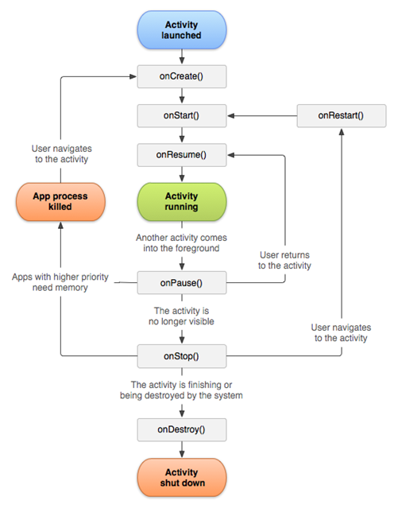

# Activity生命周期

Android是以`Activity (界面)`方式向用户展示应用，那么这个`Activity`的生命周期如下：

**生命周期包含** `3`个阶段，`7`个方法



## 7个方法

- `void onCreate(Bundle savedInstanceState)` : 在Activity对象被第一次创建时调用
- `void onStart()` : 当Activity变得可见时调用
- `void onRestart()` : 当一个Activity再次启动之前调用
- `void onResume()` : 当Activity开始准备和用户交互时调用,Activity对象处于运行状态。
- `void onPuase()` : 当系统即将启动另外一个Activity之前调用,另一个Activity位于上层，但是本Activity还可见
- `void onStop()` : 当前Activity变得不可见时调用
- `void onDestory()` : 当前Activity被销毁之前调用

```
Paused状态常用于：另一个Activity为对话框，弹出来之后只占据了屏幕的一小部分；但后面的Activity还是可见的，但是处于paused状态。
注：一个Activity出于paused状态时，系统并不会释放资源。释放资源你的操作要靠开发者来完成。
```

## 3个阶段

- `创建活跃阶段` : `onCreate` -> `onStart` -> `onResume`
- `重新活跃阶段` : `onRestart` -> `onStart` -> `onResume`
- `销毁阶段` : `onPuase` -> `onStop` -> `onDestory`

## 参考文档

[`Actvity生命周期`](http://www.cnblogs.com/smyhvae/p/3856555.html)

## 视频

[`第四集android生命周期的介绍`](https://pan.baidu.com/play/video#video/path=%2FAndroid%2F%E5%A6%82%E4%BD%95%E6%90%AD%E5%BB%BAandroid%E5%BC%80%E5%8F%91%E7%8E%AF%E5%A2%83%20%EF%BC%88Android%E5%85%A5%E9%97%A8%E4%BB%8B%E7%BB%8D%EF%BC%89%E7%AC%AC%E5%9B%9B%E9%9B%86android%E7%94%9F%E5%91%BD%E5%91%A8%E6%9C%9F%E7%9A%84%E4%BB%8B%E7%BB%8D.avi&t=-1)