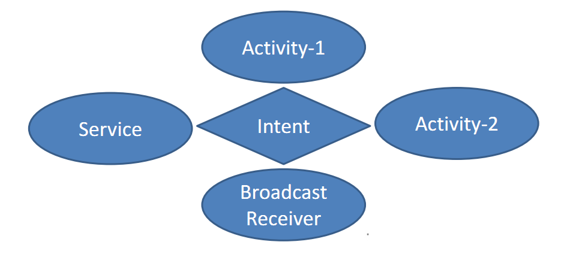
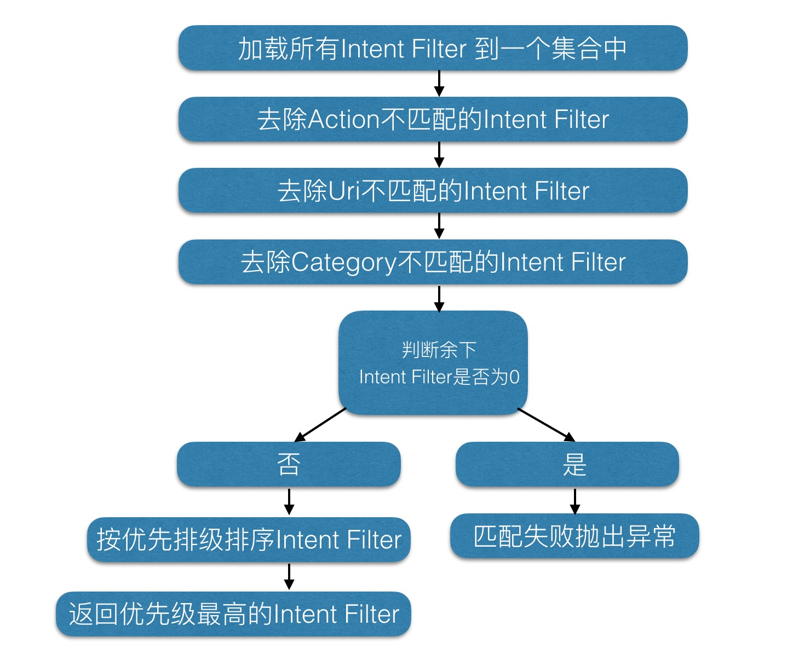

# Intent

请仔细阅读参考文档：[`Android组件系列----Intent详解`](http://www.cnblogs.com/smyhvae/p/3959204.html)

Intent组件可能不是四大组件，但却是连接四大组件的桥梁

Android中提供了Intent机制来协助应用间的交互与通讯，或者采用更准确的说法是，Intent不仅可用于应用程序之间，也可用于应用程序内部的`activity`, `service`和`broadcast receiver`之间的交互

Intent是一种运行时绑定（runtime binding)机制，它能在程序运行的过程中连接两个不同的组件。通过Intent，你的程序可以向Android表达某种请求或者意愿，Android会根据意愿的内容选择适当的组件来响应

activity、service和broadcast receiver之间是通过Intent进行通信的，而另外一个组件Content Provider本身就是一种通信机制，不需要通过Intent



## Intent对于不同组件有不同的使用方式

 - Activity   

  使用`Context.startActivity()` 或 `Activity.startActivityForResult()`，传入一个`intent`来启动一个activity，使用 `Activity.setResult()`，传入一个intent来从activity中返回结果
 - Service    

 将intent对象传给`Context.startService()`来启动一个service或者传消息给一个运行的service。将intent对象传给 `Context.bindService()`来绑定一个service。

- Broadcast Receiver    

  将intent对象传给 `Context.sendBroadcast()`，`Context.sendOrderedBroadcast()`，或者`Context.sendStickyBroadcast()`等广播方法，则它们被传给 broadcast receiver

## Intent组成部分

- `component`(组件)：目的组件
- `action`（动作）：意图行为
- `category`（类别）：动作类别
- `data`（数据）：动作要操纵的数据
- `type`（数据类型）：对于data范例的描写
- `extras`（扩展信息）：额外数据
- `flags`（标志位）：期望这个意图的运行模式

## Intent类型

- 显式Intent（直接类型）
- 隐式Intent（间接类型）

官方建议使用隐式Intent。上述组成中，component属性为直接类型，其他均为间接类型    
显示类型通过`直接指定组件`来表明意图   
隐式类型通过`匹配`抽象的`action`和`category`等信息,通过系统自己分析Intent来最终确定操作意图（Activity）    

## Activity Intent Filter 匹配过程



### component(组件)

如果 component这个属性有指定的话，将直接使用它指定的组件。指定了这个属性以后，Intent的其它所有属性都是可选的    
例如，启动第二个Activity时，我们可以这样来写
```java
button1.setOnClickListener(new OnClickListener() {            
    @Override
    public void onClick(View v) {
        //创建一个意图对象
        Intent intent = new Intent();
        //创建组件，通过组件来响应
        ComponentName component = new ComponentName(MainActivity.this, SecondActivity.class);
        intent.setComponent(component);                
        startActivity(intent);                
    }
});
```

通过监听事件onClick()方法来简写：

```java
Intent intent = new Intent();
//setClass函数的第一个参数是一个Context对象
//Context是一个类，Activity是Context类的子类，也就是说，所有的Activity对象，都可以向上转型为Context对象
//setClass函数的第二个参数是一个Class对象，在当前场景下，应该传入需要被启动的Activity类的class对象
intent.setClass(MainActivity.this, SecondActivity.class);
startActivity(intent);
```

或者

```java
Intent intent = new Intent(MainActivity.this,SecondActivity.class);
startActivity(intent);
```

### Action（动作）

生活中，描述一个意愿或愿望的时候，总是有一个动词在其中。当你指明了一个Action，执行者就会依照这个动作的指示，接受相关输入，表现对应行为，产生符合的输出。在Intent类中，定义了一批量的动作，比如ACTION_VIEW，ACTION_PICK等， 基本涵盖了常用动作。加的动作越多，越精确;    

Action 是一个用户定义的字符串，用于描述一个 Android 应用程序组件，一个 Intent Filter 可以包含多个 Action。在 AndroidManifest.xml 的Activity 定义时，可以在其 `<intent-filter>`节点指定一个 `Action`列表用于标识 `Activity` 所能接受的`动作`


### category（类别）

Category属性也是作为<intent-filter>子元素来声明的。例如：
```xml
<intent-filter>
　　<action android:name="com.example.intent.MY_ACTION"></action>
　　<category android:name="com.example.intent.MY_CATEGORY"></category> 
　　<category android:name="android.intent.category.DEFAULT"></category> 
</intent-filter> 
```

Action 和category通常是一起使用的，首先我们在`AndroidManifest.xml`中注册`SecondActicity`的`action`和`category`,如下：

```xml
<activity 
  android:name=".SecondActivity">
    <intent-filter>
         <action android:name="com.example.intent.MY_ACTION"/>
         <category android:name="android.intent.category.DEFAULT" />
    </intent-filter>            
</activity>
```

上方代码，表示SecondActicity可以匹配MY_ACTION这个动作，此时，如果在其他的Acticity通过这个action的条件来查找，那SecondActicity就具备了这个条件。

**注：如果没有指定的category，则必须使用默认的DEFAULT**

也就是说：只有<action>和<category>中的内容同时能够匹配上Intent中指定的action和category时，这个活动才能响应Intent。如果使用的是DEFAULT这种默认的category，在稍后调用startActivity()方法的时候会自动将这个category添加到Intent中

修改MainActivity.java中按钮的点击事件，代码如下：     

```java
button1.setOnClickListener(new OnClickListener() {            
    @Override
    public void onClick(View v) {
        //启动另一个Activity，（通过action属性进行查找）
        Intent intent = new Intent();
        //设置动作（实际action属性就是一个字符串标记而已）
        intent.setAction("com.example.intent.MY_ACTION"); //方法：Intent android.content.Intent.setAction(String action)
        startActivity(intent);        
    }
});
```

上方代码中，也可以换成下面这种简洁的方式：

```java
button1.setOnClickListener(new OnClickListener() {            
    @Override
    public void onClick(View v) {
        //启动另一个Activity，（通过action属性进行查找）
        Intent intent = new Intent("com.example.intent.MY_ACTION");//方法： android.content.Intent.Intent(String action)                
        startActivity(intent);        
    }
});
```

在这个Intent中，我并没有指定具体哪一个Activity，我只是指定了一个action的常量。所以说，隐式Intent的作用就表现的淋漓尽致了。此时，点击MainActicity中的按钮，就会跳到SecondActicity中去

上述情况只有SecondActicity匹配成功。如果有多个组件匹配成功，就会以对话框列表的方式让用户进行选择。    
新建文件`ThirdActicity.java`和activity_third.xml，然后在清单文件`AndroidManifest.xml`中添加`ThirdActivity`的`action`和`category`的过滤器,如下：

```xml
<activity 
   android:name=".ThirdActivity">
   <intent-filter>
        <action android:name="com.example.intent.MY_ACTION"/>
        <category android:name="android.intent.category.DEFAULT" />
   </intent-filter>            
</activity>
```

如果有多个组件被匹配成功，就会以对话框列表的方式让用户进行选择。    
每个Intent中只能指定一个action，但却能指定多个category；类别越多，动作越具体，意图越明确    

目前我们的Intent中只有一个默认的category，现在可以通过intent.addCategory()方法来实现。修改MainActivity中按钮的点击事件，代码如下

```java
button1.setOnClickListener(new OnClickListener() {            
    @Override
    public void onClick(View v) {
        //启动另一个Activity，（通过action属性进行查找）
        Intent intent = new Intent();
        //设置动作（实际action属性就是一个字符串标记而已）
        intent.setAction("com.example.intent.MY_ACTION"); //方法：Intent android.content.Intent.setAction(String action)
        intent.addCategory("com.example.intent.MY_CATEGORY");
        startActivity(intent);        
    }
});
```

既然在Intent中增加了一个category，那么我们要在清单文件中去声明这个category，不然程序将无法运行。代码如下

```xml
<activity android:name=".SecondActivity">
    <intent-filter>
         <action android:name="com.example.intent.MY_ACTION"/>
         <category android:name="android.intent.category.DEFAULT" />
         <category android:name="com.example.intent.MY_CATEGORY" />
    </intent-filter>            
</activity>
```

此时，点击MainActicity中的按钮，就会跳到SecondActicity中去

**总结**    
自定义类别： 在Intent添加类别可以添加多个类别，那就要求被匹配的组件必须同时满足这多个类别，才能匹配成功。操作Activity的时候，如果没有类别，须加上默认类别

### data（数据）

- Data属性是Android要访问的数据，和action和Category声明方式相同，也是在<intent-filter>中。
多个组件匹配成功显示优先级高的； 相同显示列表。
- Data是用一个uri对象来表示的，uri代表数据的地址，属于一种标识符。通常情况下，我们使用action+data属性的组合来描述一个意图：做什么

使用隐式Intent，我们不仅可以启动自己程序内的活动，还可以启动其他程序的活动，这使得Android多个应用程序之间的功能共享成为了可能。比如应用程序中需要展示一个网页，只需调用系统的浏览器来打开这个网页就行了

MainActivity.java中，监听器部分的核心代码如下   

```java
button1.setOnClickListener(new OnClickListener() {            
    @Override
    public void onClick(View view) {
        Intent intent = new Intent();
        intent.setAction(Intent.ACTION_VIEW);               // 指定了Intent的action是 Intent.ACTION_VIEW，表示查看的意思，这是一个Android系统内置的动作；
        Uri data = Uri.parse("https://www.google.com.hk");  // 通过Uri.parse()方法，将一个网址字符串解析成一个Uri对象，再调用intent的setData()方法将这个Uri对象传递进去
        intent.setData(data);                
        startActivity(intent);        
    }
});
```

上方代码也可以简写成：

```java
button1.setOnClickListener(new OnClickListener() {            
    @Override
    public void onClick(View view) {
        Intent intent = new Intent(Intent.ACTION_VIEW);
        intent.setData(Uri.parse("https://www.google.com.hk"));                
        startActivity(intent);        
    }
});
```


如果有多个组件得到了匹配，那么也会弹出选择框提示选择要使用的activity

**总结**

- 当Intent匹配成功的组件有多个时，显示优先级高的组件，如果优先级相同，显示列表让用户自己选择
- 优先级从-1000至1000，并且其中一个必须为负的才有效

**注：系统默认的浏览器并没有做出优先级声明，其优先级默认为正数**

在清单文件中修改对SecondAcivity的声明，即增加一行代码，通过来`android:priority`设置优先级，如下:

```xml
<activity 
    android:name=".SecondActivity">
    <intent-filter android:priority="-1">
         <action android:name="android.intent.action.VIEW" />
         <category android:name="android.intent.category.DEFAULT" />
         <data android:scheme="https" android:host="www.google.com.hk"/>                                  
    </intent-filter>            
</activity>
```

注：

Data属性的声明中要指定访问数据的Uri和MIME类型。可以在<data>元素中通过一些属性来设置：

`android:scheme` `android:path` `android:port` `android:mimeType` `android:host`等，通过这些属性来对应一个典型的Uri格式scheme://host:port/path。例如：`http://www.google.com`

### type（数据类型）

如果Intent对象中既包含Uri又包含Type，那么，在<intent-filter>中也必须二者都包含才能通过测试

Type属性用于明确指定Data属性的数据类型或MIME类型，但是通常来说，当Intent不指定Data属性时，Type属性才会起作用，否则Android系统将会根据Data属性值来分析数据的类型，所以无需指定Type属性

**data和type属性一般只需要一个，通过setData方法会把type属性设置为null，相反设置setType方法会把data设置为null，如果想要两个属性同时设置，要使用Intent.setDataAndType()方法**

```java
button.setOnClickListener(new OnClickListener(){
    @Override
    public void onClick(View v) {
        Intent intent = new Intent();
        intent.setAction(Intent.ACTION_VIEW);
        Uri data = Uri.parse("file:///storage/sdcard1/someone.mp3"); // file://"表示查找文件，后面再加上我的小米手机存储卡的路径：/storage/sdcard1，再加上具体歌曲的路径
        intent.setDataAndType(data, "audio/mp3"); //设置data+type属性 ,方法：Intent android.content.Intent.setDataAndType(Uri data, String type)
        startActivity(intent);                
    }            
});
```

### extras（扩展信息）

是其它所有附加信息的集合。使用extras可以为组件提供扩展信息，比如，如果要执行“发送电子邮件”这个动作，可以将电子邮件的标题、正文等保存在extras里，传给电子邮件发送组件。

### Flags（标志位）

一个程序启动后系统会为这个程序分配一个task供其使用，另外同一个task里面可以拥有不同应用程序的activity。那么与activity的启动模式有关

### Intent的常见应用

- 打开指定网页

```java
Intent intent = new Intent(Intent.ACTION_VIEW);
intent.setData(Uri.parse("http://www.baidu.com")); 
```

- 打电话
  - 打开拨打电话界面,点击拨号拨打
```java
Intent intent = new Intent(Intent.ACTION_DIAL);
intent.setData(Uri.parse("tel:15212345678"));
```

- 直接拨打电话

需要权限AndroidManifest.xml

```xml
<uses-sdk
    android:minSdkVersion="16"
    android:targetSdkVersion="25" />
<uses-permission android:name="android.permission.CALL_PHONE"/>
```

- 打开发送短信的界面：action+type

```java
Intent intent = new Intent(Intent.ACTION_VIEW);
intent.setType("vnd.android-dir/mms-sms");
intent.putExtra("sms_body", "具体短信内容"); //"sms_body"为固定内容
startActivity(intent); 
```

- 打开发短信的界面(同时指定电话号码)：action+data

```java
Intent intent = new Intent(Intent.ACTION_SENDTO);
intent.setData(Uri.parse("smsto:15212345678"));
intent.putExtra("sms_body", "具体短信内容"); //"sms_body"为固定内容        
startActivity(intent);
```

- 播放指定路径音乐：action+data+type

```java
Intent intent = new Intent(Intent.ACTION_VIEW);
Uri uri = Uri.parse("file:///storage/sdcard1/someone.mp3"); // 路径也可以写成："/storage/sdcard1/someone.mp3"
intent.setDataAndType(uri, "audio/mp3"); // 方法：Intent android.content.Intent.setDataAndType(Uri data, String type)
startActivity(intent);
```
