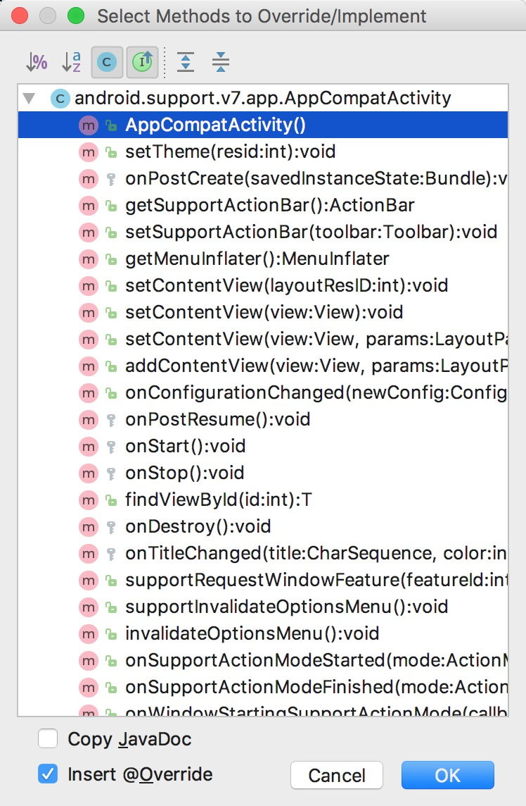

# Menu 菜单

**参考exmaple 中的 [FirstActivity](../example/FirstActivity)**

在移动应用中会需要运用到大量的菜单，而菜单的创建也需要在 `res/menu` 目录下通过 `New -> Menu resouce file`创建菜单文件:

```xml
<?xml version="1.0" encoding="utf-8"?>
<menu xmlns:android="http://schemas.android.com/apk/res/android">
    <item
        android:id="@+id/menu_add"
        android:title="@string/menu_add"/>
    <item
        android:id="@+id/menu_edit"
        android:title="@string/menu_edit"/>
</menu>
```

由此可见，菜单是通过 `<menu>`标签包裹的xml配置，`<item>`就是具体创建一个菜单项，然后通过 `android:id` 给菜单添加唯一标示，`android:title` 指定菜单名称

在 `MainAcitivity.java`中添加如下代码
```java
@Override
public boolean onCreateOptionsMenu(Menu menu) {
    // 通过getMenuInflater获取MenuInflater对象，并通过inflate方法给当前activity创建菜单
    // 第一个参数指定通过哪个资源文件创建菜单，第二个参数指定菜单项将添加到哪个菜单对象中
    // 返回true表示将菜单显示
    getMenuInflater().inflate(R.menu.main,menu);
    return true;
}

@Override
public boolean onOptionsItemSelected(MenuItem item) {
    String toastText = "";
    // 通过item.getItemId来判断点击的哪个菜单
    switch (item.getItemId()){
        case R.id.menu_add:toastText = "你点击了添加菜单";break;
        case R.id.menu_edit:toastText = "你点击了编辑菜单";break;
        default:toastText = "未知";
    }
    Toast.makeText(MainActivity.this,toastText,Toast.LENGTH_SHORT).show();
    return true;
}
```

## Errors

如果模拟器没有显示导航头部，请查看`Activity`是否是继承自 `AppCompatActivity` ，并查看`AndroidManifest.xml` 中的 `android:theme` 是否误设置成了`Theme.AppCompat.NoActionBar`


## Android Studio 快捷键

`Control + o` 可弹出当前类可以覆写和实现的方法


