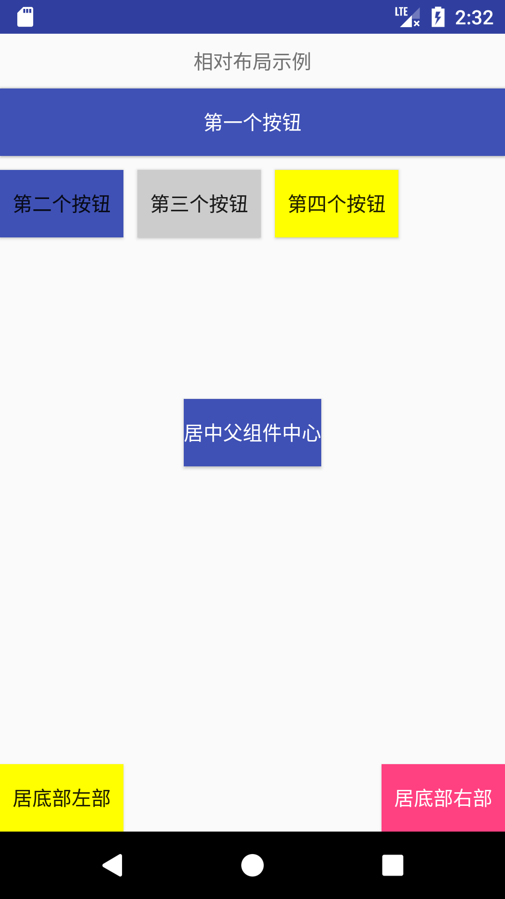

# RelativeLayout

> 相对布局

## 常用属性

- `layout_alignParentLeft` : 相对父组件距左
- `layout_alignParentRight` : 相对父组件距右
- `layout_alignParentTop` : 相对父组件距上
- `layout_alignParentBottom` : 相对父组件距下
- `layout_centerInParent` : 相对父组件的中间(水平和垂直方向)
- `layout_above` : 相对某个组件的上方
- `layout_below` : 相对某个组件的下方
- `layout_toLeftOf` : 相对某个组件的左方
- `layout_toRightOf` : 相对某个组件的右方

