# Hello World

创建第一个著名的程序`Hello world`   

## 新建工程

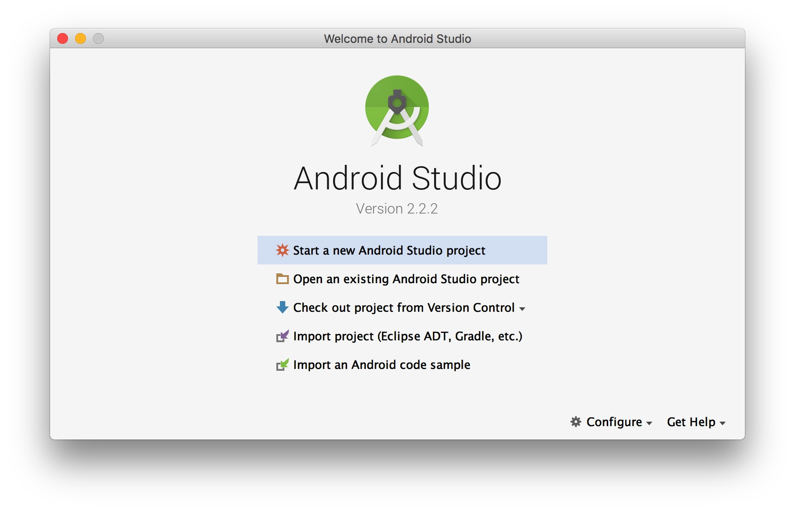

## 输入项目名称

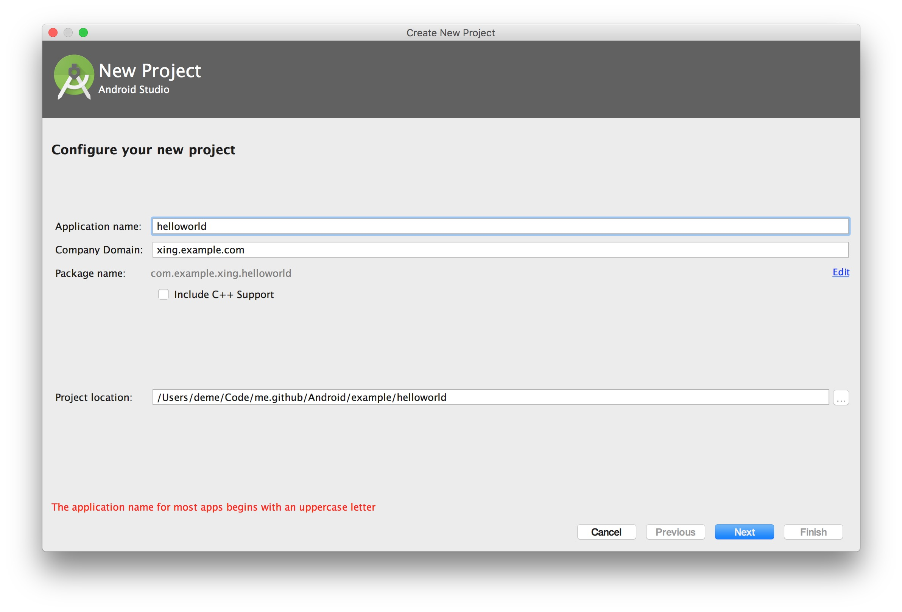

## 选择API Level

选择`API 16`作为我们支持的最低API版本，因为该平台市场占用率还是挺多的，所以还在考虑范围内！！

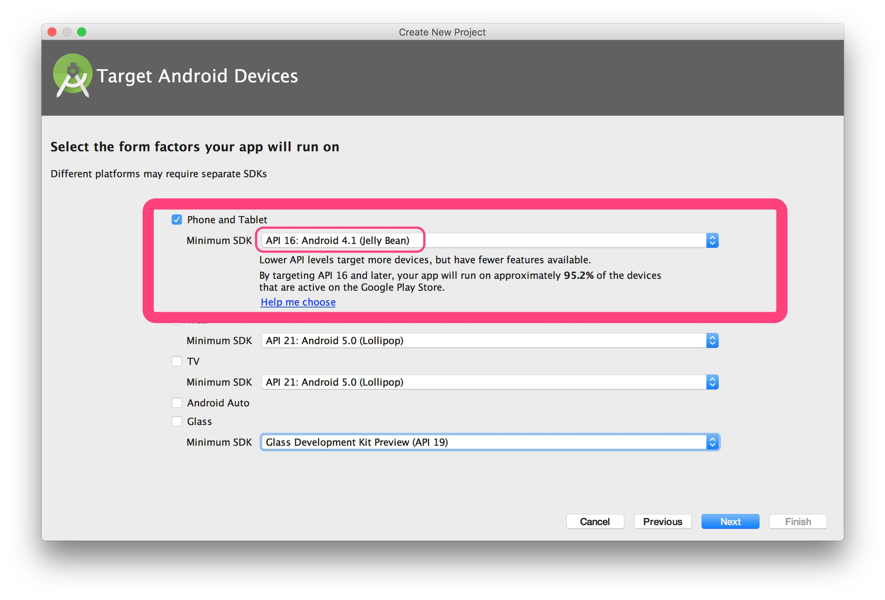

## 选择Activity

选择`Basic Activity`即可.

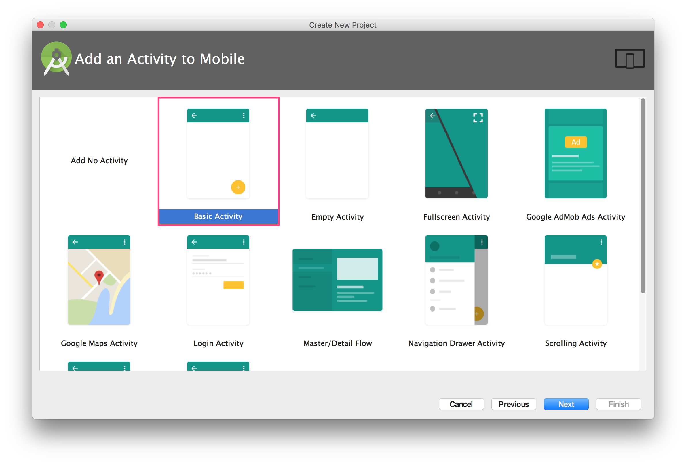

## Customized Activity

选择默认，点击`Finish`

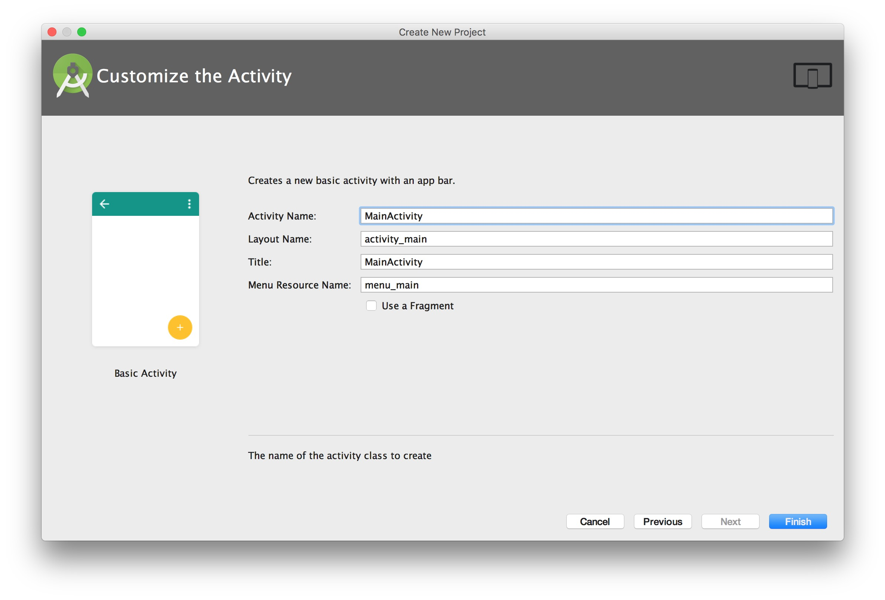

## 项目视图

默认进入时是`Android`视图，只会看到Android相关的东西...

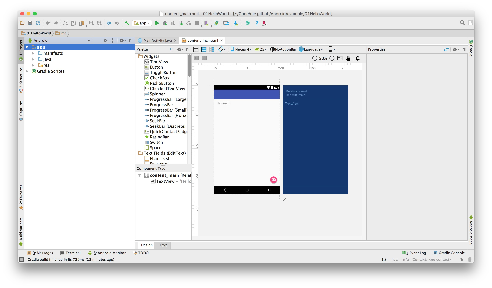

## 切换项目视图

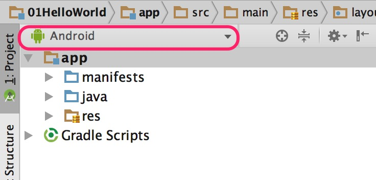

## `Project`视图

project 视图下可以看到所有项目下的文件...

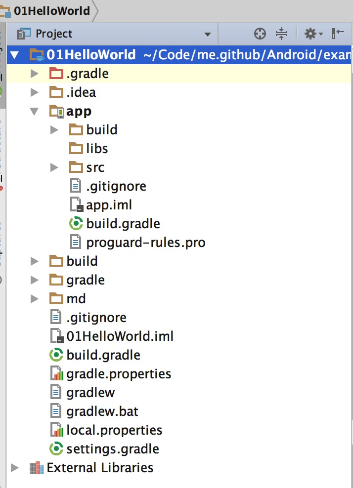

## build.gradle

build.gradle中包含了我们编译打包时需要的一些信息，如：

- `compileSdkVersion` : 编译SDK版本
- `buildToolsVersion` : 构建工具API版本
- `minSdkVersion` : API最小支持版本
- `targetSdkVersion` : 目标SDK版本
- `versionCode` : 打包apk版本
- `versionName` : 打包apk版本显示名称

具体配置参见[`Gradle`](../../../Gradle/README.md)

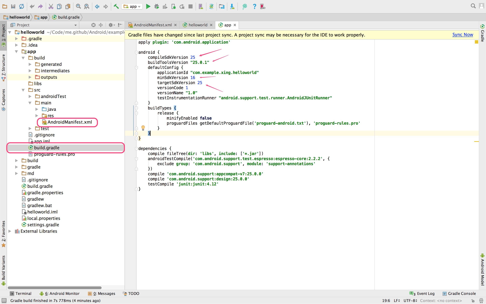

## 确认是否安装刚才选择的`API Level` `API 16`

如果没有请先安装...,也可以点击`SDK Manager`进行安装

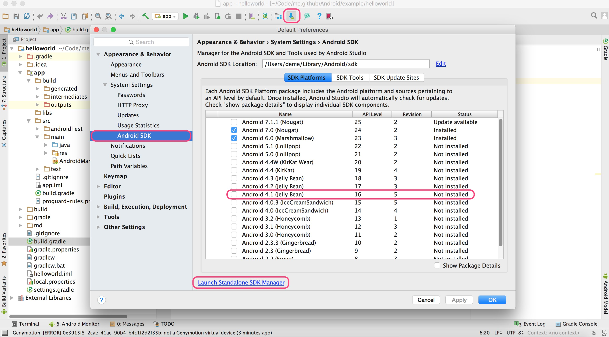

## 确认是否安装对应API Level 模拟器

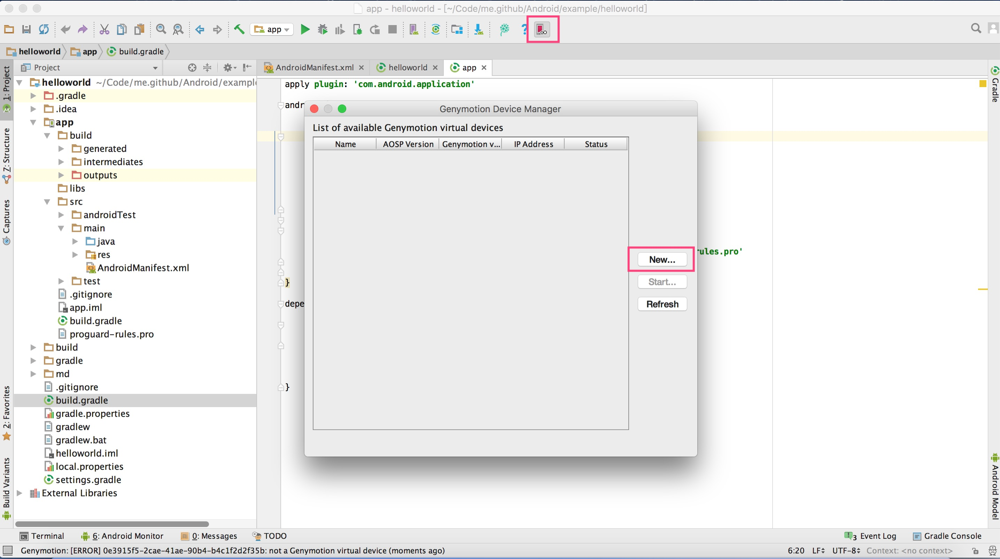

如果没有则创建,选择`API 16`模拟器

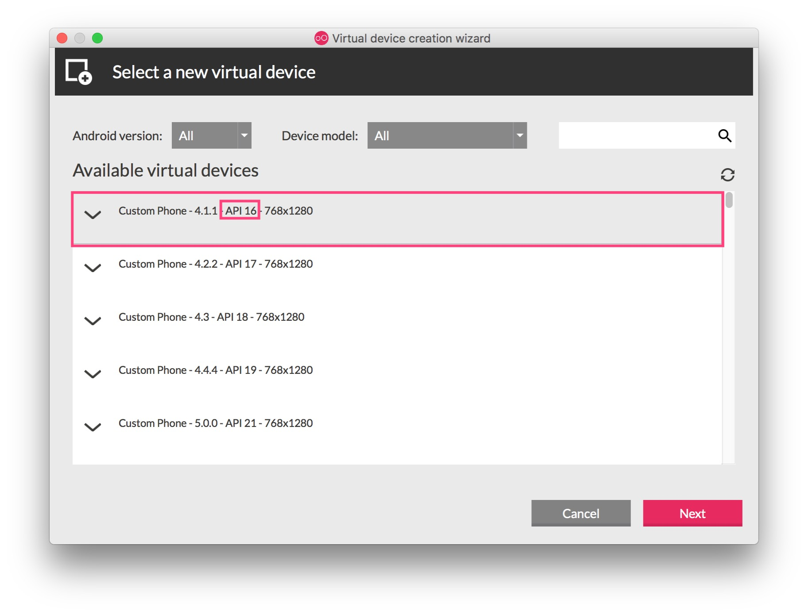

## 启动模拟器

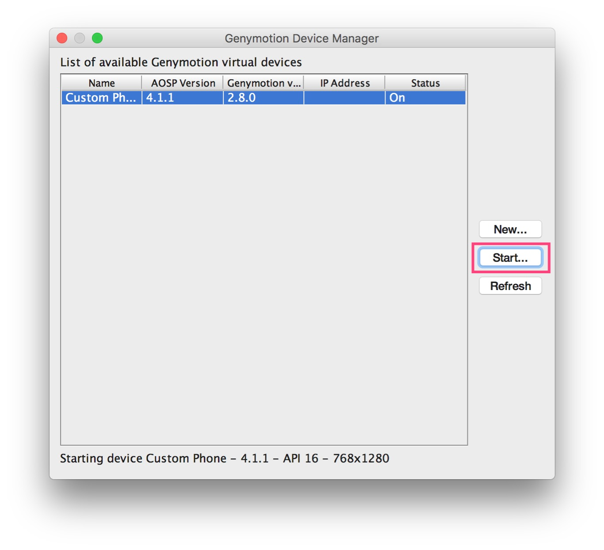

## 选择对应模拟器编译启动APP

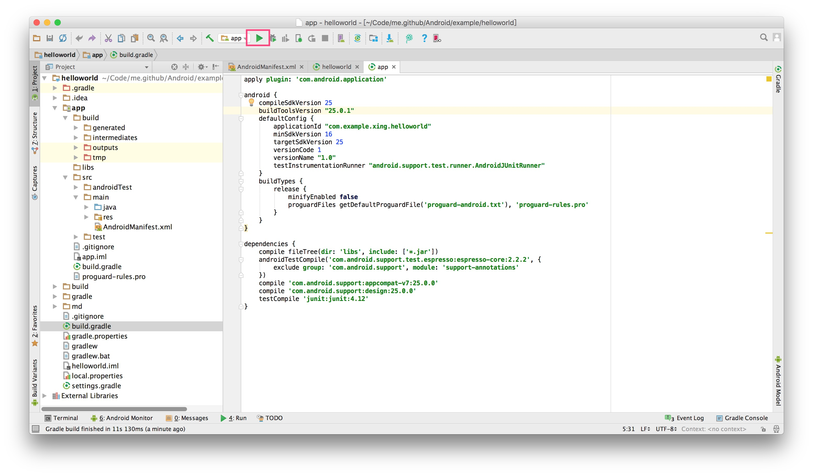

选择模拟器，点击`OK`启动

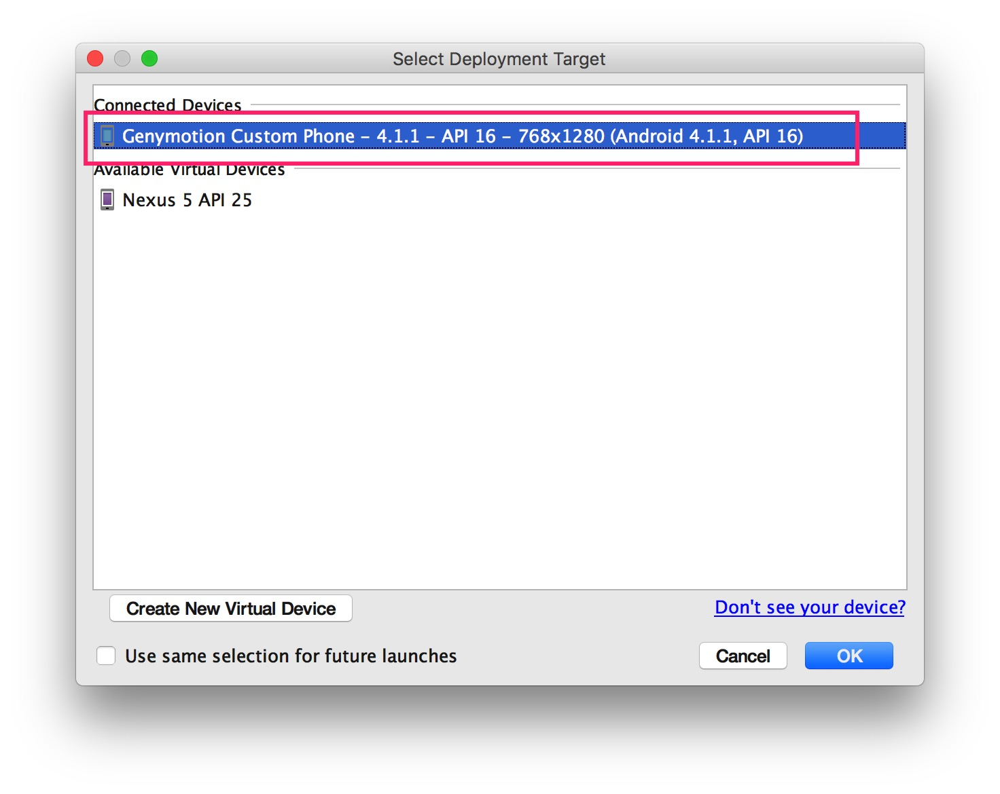

`// TODO`  
我在直接点击启动时，也会提示可以创建模拟器，但这个好像是`Android Studio`默认的模拟器，而且我没发现有API 16的模拟器可以创建...这里需要后面了解更多后修正... 

## 效果图

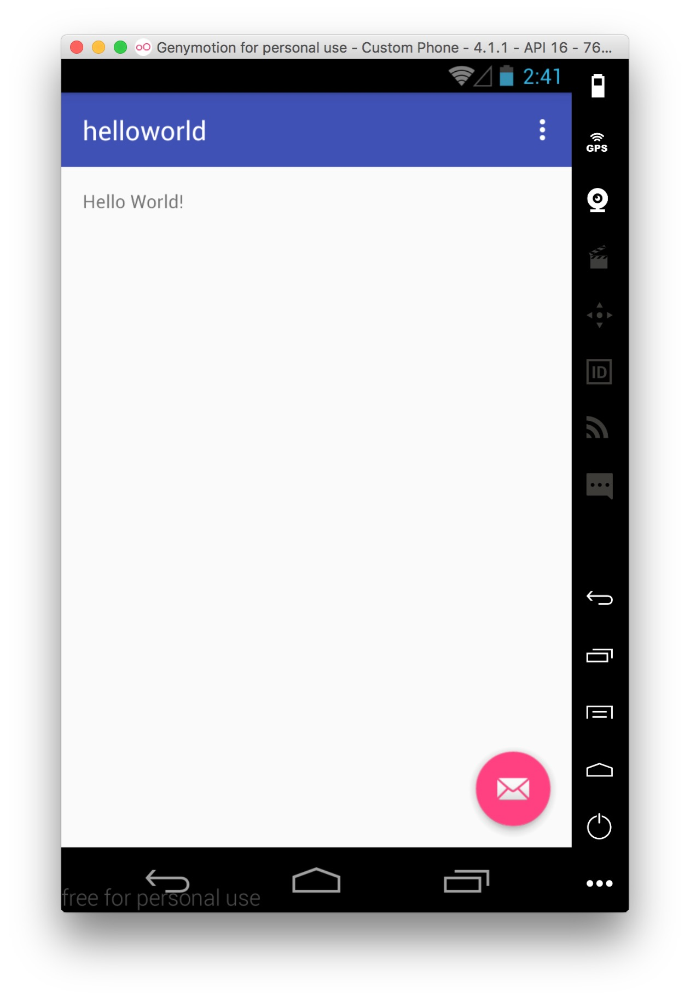

