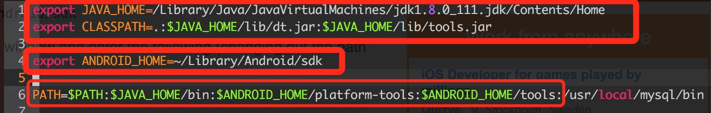
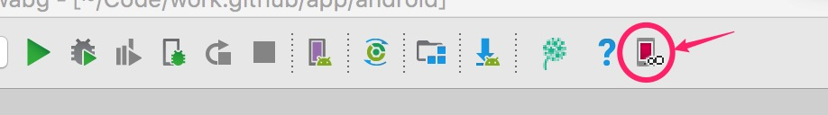
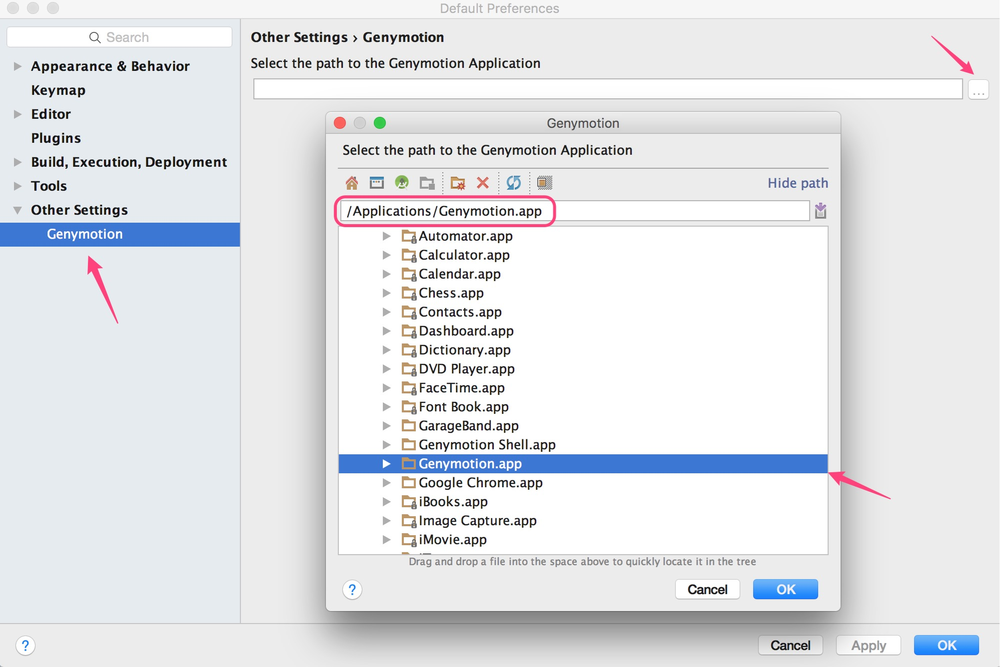
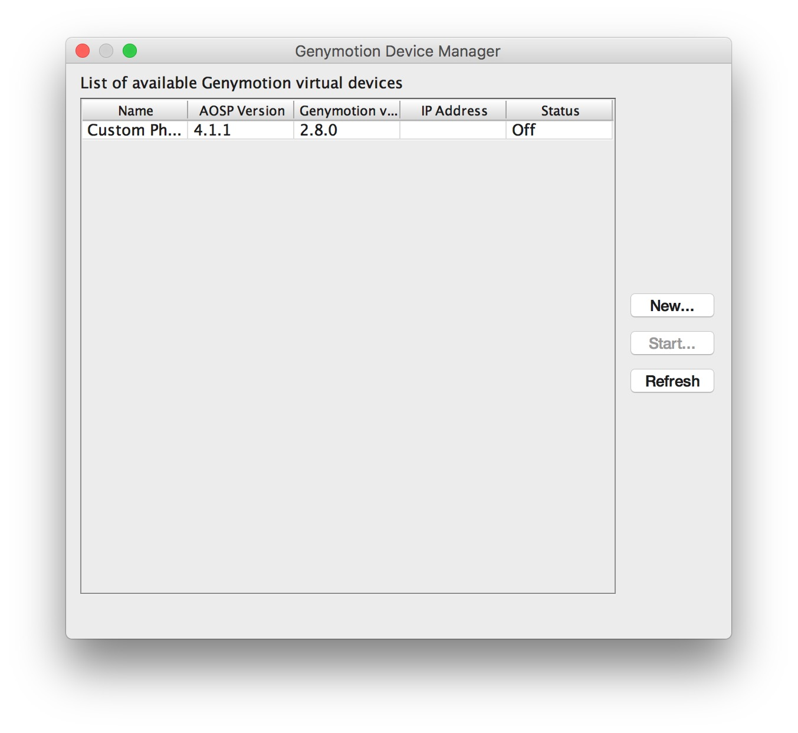

# 搭建开发环境

环境依赖：[`JDk`](http://www.oracle.com/technetwork/java/javase/downloads/index.html) [`Android Studio`](https://developer.android.com/studio/index.html)

**注** 由于`Android Studio`带有`Android SDK`管理,所以这里不需要下载

参考文档：[`Mac上搭建Android开发环境`](http://blog.163.com/zhou_411424/blog/static/19736215620130161284750/) [`使用Android Studio搭建Android集成开发环境（图文教程）`](http://www.cnblogs.com/smyhvae/p/4022844.html)

## 目录

- [JDK](#jdk)
  - [JDK安装](#jdk安装)
  - [配置JAVA_HOME环境变量](#配置java_home环境变量)
  - [卸载](#卸载)
- [Android SDK](#android-sdk)
- [Android Studio](#android-studio)
  - [Reference](#reference)
  - [Android Studio安装](#android-studio安装)
  - [配置ANDROID_HOME环境变量](#配置android_home环境变量)
  - [Android Studio卸载](#android-studio卸载)
- [立即更新修改项](#立即更新修改项)
- [配置图](#配置图)
- [模拟器安装](#模拟器安装)
  - [安装Virtual Box](#安装virtual-box)
  - [注册用户](#注册用户)
  - [Genymontion下载并安装](#genymontion下载并安装)
  - [安装Genymontion插件](#安装genymontion插件)
  - [新建模拟器](#新建模拟器)

## JDK

Mac上自带`JDK`但是版本比较旧，我安装的`JDK1.8` 通过`java -version`可以查看JDK版本.

### JDK安装

下载好JDK后直接安装，默认安装目录：`/Library/Java/JavaVirtualMachines/`

### 配置`JAVA_HOME`环境变量

`vim ~/.bash_profile`

```shell
export JAVA_HOME=/Library/Java/JavaVirtualMachines/jdk1.8.0_111.jdk/Contents/Home 
export PATH=$JAVA_HOME/bin:$PATH 
export CLASSPATH=.:$JAVA_HOME/lib/dt.jar:$JAVA_HOME/lib/tools.jar
```

### 卸载

- 在`finder`中查找`JavaAppletPlugin.plugin` 并删除   
- `sudo rm -rf /Library/PreferencesPanes/JavaControlPanel.prefPane`
- `sudo rm -rf /Library/Java/JavaVirtualMachines/*`

## Android Studio

### Reference

[`Android Studio教程从入门到精通`](http://www.open-open.com/lib/view/open1433387390635.html) Android Studio 使用安装教程    
[`android-studio.org`](http://www.android-studio.org/) Android Studio 相关文档及部分视频教程

### Android SDK

Android SDK 是Google提供的Android开发工具包，在Android开发时，需要引入该工具包，来使用Android相关的API

### Android Studio安装

下载好Android Studio 后一路`OK安装`就可以了.

### 配置`ANDROID_HOME`环境变量

- [Setting ANDROID_HOME enviromental variable on Mac OS X](http://stackoverflow.com/questions/19986214/setting-android-home-enviromental-variable-on-mac-os-x)

我是第三种方法所以在`/Users/{YOUR_USER_NAME}/Library/Android/sdk`下面

`vim ~/.bash_profile`

```shell
export ANDROID_HOME={YOUR_PATH}
export PATH=$PATH:$ANDROID_HOME/tools:$ANDROID_HOME/platform-tools
```

### Android Studio卸载

[`Mac完整卸载Android Studio的方法`](http://www.aichengxu.com/android/10966020.htm)

#### 卸载Android Studio 在终端(terminal)执行以下命令

```shell
rm -Rf /Applications/Android\ Studio.app
rm -Rf ~/Library/Preferences/AndroidStudio*
rm ~/Library/Preferences/com.google.android.studio.plist
rm -Rf ~/Library/Application\ Support/AndroidStudio*
rm -Rf ~/Library/Logs/AndroidStudio*
rm -Rf ~/Library/Caches/AndroidStudio*
```

#### 删除Projects

`rm -Rf ~/AndroidStudioProjects`

#### 删除gradle

`rm -Rf ~/.gradle`

#### 卸载Android Virtual Devices(AVDs) and *.keystore

**注意**：如果有其他IDE需要用到，请不要删除

`rm -Rf ~/.android`

#### 删除Android SDK Tools

**注意**：如果有其他IDE需要用到，请不要删除

`rm -Rf ~/Library/Android*`

## 立即更新修改项
```shell
source ~/.bash_profile
```

## 配置图



## 模拟器安装

[`Android Studio2.0 教程从入门到精通MAC版 - 安装篇`](http://www.open-open.com/lib/view/open1466430392743.html)    

Android Stuido里面的AVD Manager可以创建模拟器，使用起来也比较简单，缺点就是性能不行，现在比较流行使用Genymotion，号称史上最快的Android模拟器。下面我们就来装Genymontion。

### 安装Virtual Box

[`virtualbox.org`](https://www.virtualbox.org/wiki/Downloads) 

### 注册用户

[Genymotion](https://www.genymotion.com/)

### Genymontion下载并安装

[Genymotion](https://www.genymotion.com/download/)

### 安装Genymontion插件

在Android Studio里打开`Preferences`设置，并找到`Plugins`后点击`Browse Repositories`,然后搜索`Genymotion`并安装+重启,你就会看到Genymontion的图标



第一次打开会提示选择Genymontion路径`/Applications/Genymotion.app`



### 新建模拟器

在Genymontion Device Manager中点击New按钮新建模拟器    



`提示需要登录的话请登录`   
登陆成功后可以看到可供选择的列表中有不同型号的模拟器，可以通过`版本`和`设备型号`找到你想创建的模拟器。然后一路`Next`后坐等Genymontion下载完模拟器
