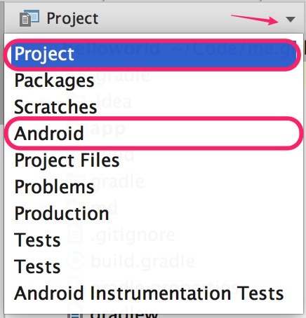
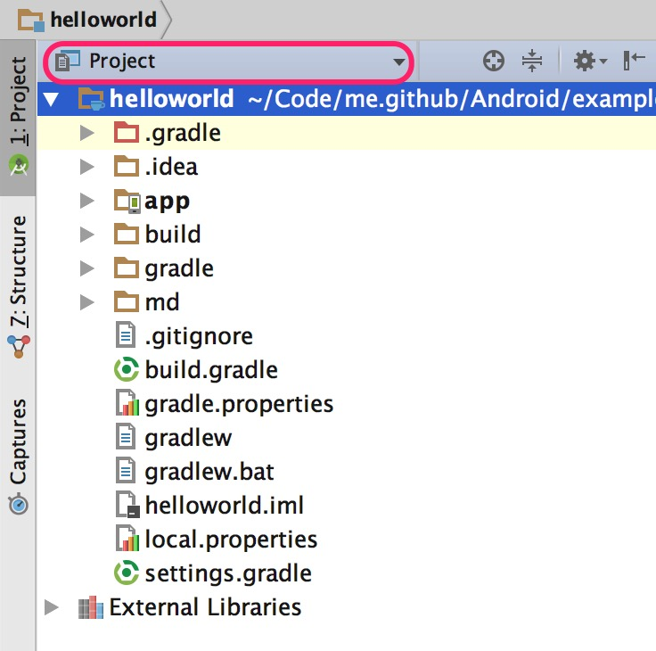
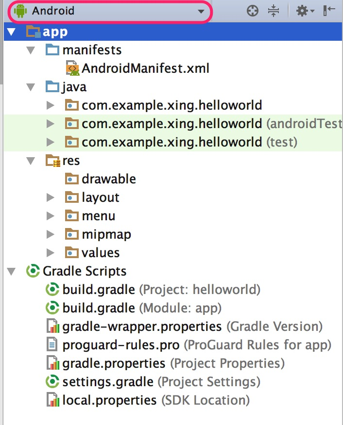

# 目录结构

## 所有视图

## Project视图

## Android视图

## 项目结构

Android项目结构主要分为以下三个模块：    
- 编译系统（Gradle）
- 配置文件
- 应用模块

---

- `.gradle` : Gradle编译系统，版本由wrapper指定
- `.idea` : Android Studio IDE所需要的文件
- `build` : 代码编译后生成的文件存放的位置
- `gradle` : wrapper的jar和配置文件所在的位置
- `.gitignore` : 使用git管理项目的忽略文件
- `build.gradle ` : 全局的gradle构建脚本，其编译的相关配置文件（相当于Makefile）
- `gradle.properties` : gradle相关的全局属性设置，__这里的配置将影响到项目所有gradle编译脚本__
- `gradlew` : *nix下的gradle wrapper可执行文件
- `graldew.bat` : windows下的gradle wrapper可执行文件
- `*.iml` : IntelliJ IDEA自动生成的文件(Android Studio)是基于IntelliJ 开发的
- `local.properties` : 本地属性设置（key设置），一般设置android sdk位置等属性
- `settings.gradle` : 指定项目所有引入的模块和设置相关的gradle脚本，一般情况是自动完成的，不需要手动修改

---

- `app` : Android项目主目录
  - `build` : 编译后的文件存在的位置（包括最终生成的apk也在这里面）
  - `libs` : 依赖的第三方库所在的位置（jar和aar)，这个目录下的jar包会自动添加到构建路径下
  - `src` : 源代码所在的目录
    - `androidTest` : 测试代码
    - `main` : 主要代码所在位置（src/androidTest)就是测试代码所在位置了
      - `assets` : 存放多媒体数据文件：如视频、音频，需要时创建 **不被编译**
      - `java` : 项目源文件
      - `jniLibs` : jni的一些动态库所在的默认位置(.so文件)
      - `res` : android资源文件（图片、字符串、布局等）所在位置 **会被编译，并会在编译后的`R.java`文件中生成唯一的ID**
      - `AndroidManifest.xml` : Android配置文件，所有的四大组件应该在这里注册
    - `test` : 也是测试时使用的
  - `app.iml` : IntelliJ 生成
  - `build.gradle` : 和这个项目有关的gradle配置，相当于这个项目的Makefile，一些项目的依赖就写在这里面
  - `proguard.pro` : 代码混淆配置文件

---

**res目录**

- `res` : android资源文件所在位置
  - `drawable` : 存放图片资源
  - `mipmap` : 存放应用图标资源
  - `layout` : 布局文件
  - `menu` : 菜单文件
  - `values` : 存放`字符串` `样式` `颜色` 等常量数据

---

- `External Libraries` : 外部库
  - 第一行<Adnroid API * PlatForm> ：表示当前编译Android API版本
  - 第二行<1.*> ：表示使用的JDK的版本
  - 第三行至以后 ：表示使用了第三方的包

`这些目录或文件具体有什么样的功能或该如何配置，待我超神后续写...`

## Reference

[`Android Studio初步使用及HelloWorld详解`](https://www.zybuluo.com/stepbystep/note/63311)
[`Android Studio目录结构浅析`](https://segmentfault.com/a/1190000002963895)
